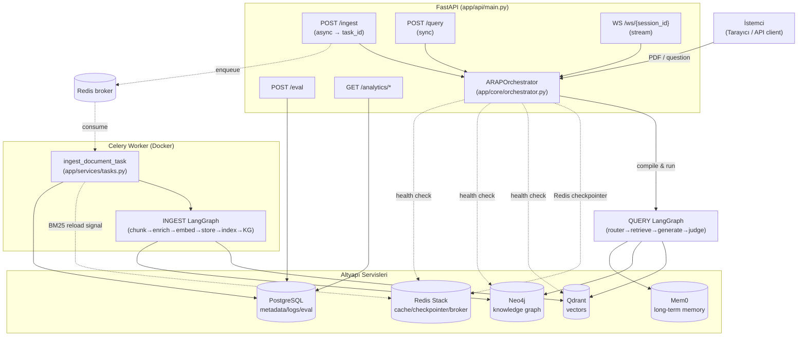
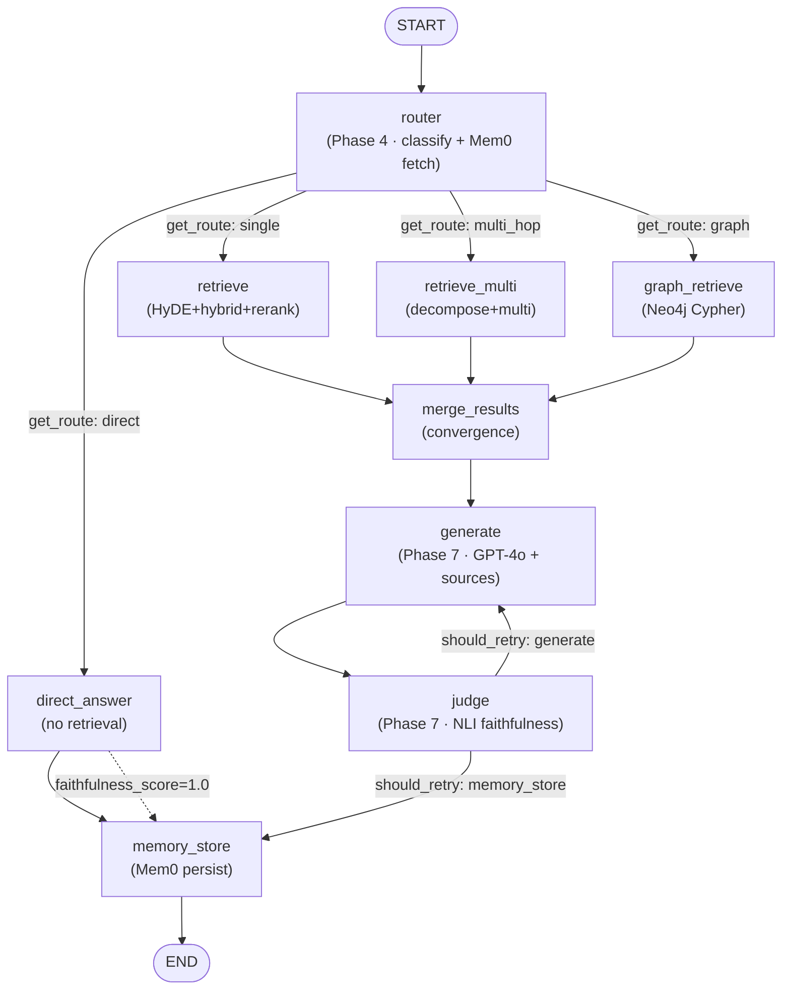
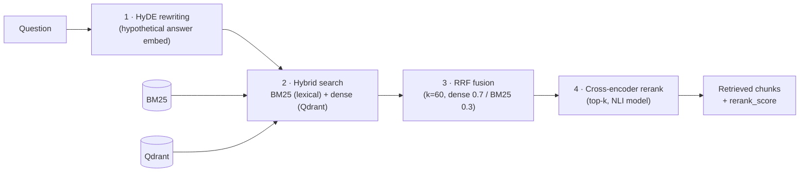
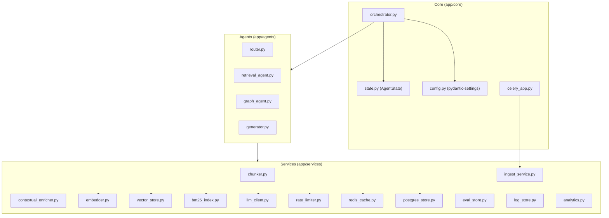
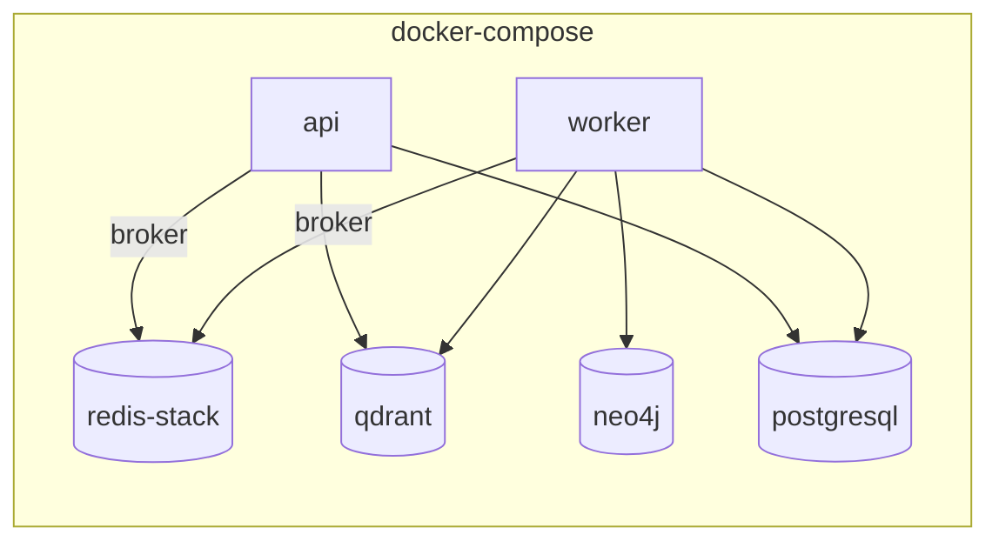
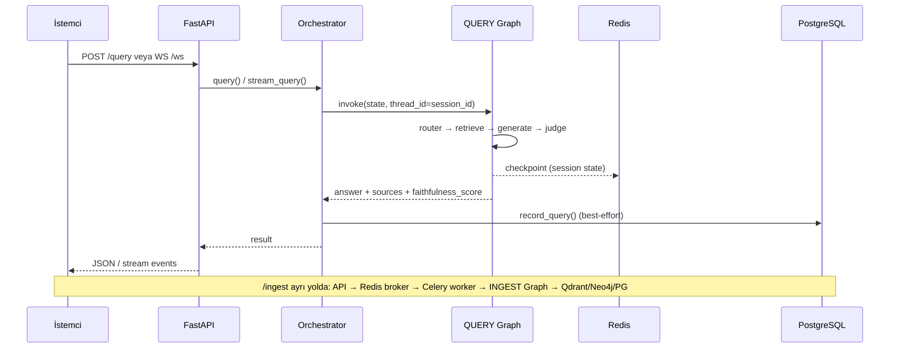

# ARAP — Mimari Diyagramlar (Architecture)

Bu dosya **Adaptive Research & Analysis Platform (ARAP)**'in mimarisini
Mermaid diyagramları ile açıklar. Diyagramlar `app/core/orchestrator.py`,
`app/api/main.py` ve `app/agents/*` modüllerindeki gerçek kod topolojisine
dayanmaktadır. GitHub ve VS Code (Mermaid uzantısı) bu dosyayı doğrudan render eder.

---

## 1. Sistem Genel Bakışı (System Overview)

Kullanıcı/istemci istekleri FastAPI'ye gelir. `/ingest` zaman alan PDF
işlemeyi **Celery worker**'a (Redis broker) devreder; `/query` ve `/ws` ise
her istekte derlenen **QUERY LangGraph**'ını çalıştırır. Tüm kalıcı ve
geçici durum beş altyapı servisi üzerinde tutulur.

---

## 2. INGEST Grafiği (Belge İşleme — bir kez PDF başına)

`app/core/orchestrator.py → build_ingest_graph()`. Doğrusal, dalsız boru
hattı. **KG çıkarımı sona konur** ki belge Qdrant/BM25 üzerinden hâlâ
aranabilir olsun (graceful degradation). Checkpointer yoktur (stateless).

---

## 3. QUERY Grafiği (Sorgu — istek başına, adaptif)

`app/core/orchestrator.py → build_query_graph()`. İki koşullu kenar vardır:
(1) `router → get_route()` 4 stratejiye dallanır; (2) `judge → should_retry()`
retrieve/üretim döngüsü. Tek döngü (retry loop) LangGraph'ın döngü desteğiyle
sağlanır. Redis checkpointer `session_id` ile çoklu-tur hafızayı korur.

> **Adaptif yönlendirme stratejileri** (`app/agents/router.py`):
> `direct` (parametrik bilgi, retrieve yok) · `single` (tek hibrit tur) ·
> `multi_hop` (alt sorulara böl + birleştir) · `graph` (Neo4j Cypher).
> Hata durumunda `single`'a düşer.

---

## 4. Retrieval Stack (4 Katman)

`app/agents/retrieval_agent.py` içinde hem `retrieve` hem `retrieve_multi`
tarafından kullanılır.

> Sonuçlar Redis'te `(question, doc_id)` anahtarıyla cache'lenir.

---

## 5. Servis Katmanı ve Bağımlılıklar

---

## 6. Altyapı Servisleri (Docker Compose)

| Servis | Görüntü | Rol |
| --- | --- | --- |
| **API** | `Dockerfile` | FastAPI + Uvicorn (HTTP + WebSocket) |
| **Worker** | `Dockerfile` | Celery worker (async ingest) |
| **Qdrant** | `qdrant/qdrant:v1.12.0` | Dense vector store (`arap_docs`) |
| **Neo4j** | `neo4j:5.25-community` | Knowledge graph (Cypher) |
| **Redis Stack** | `redis/redis-stack:latest` | Checkpointer + broker + cache |
| **PostgreSQL** | `postgres:16-alpine` | Metadata, logs, eval, history |

---

## 7. Akış Özeti (End-to-End)

