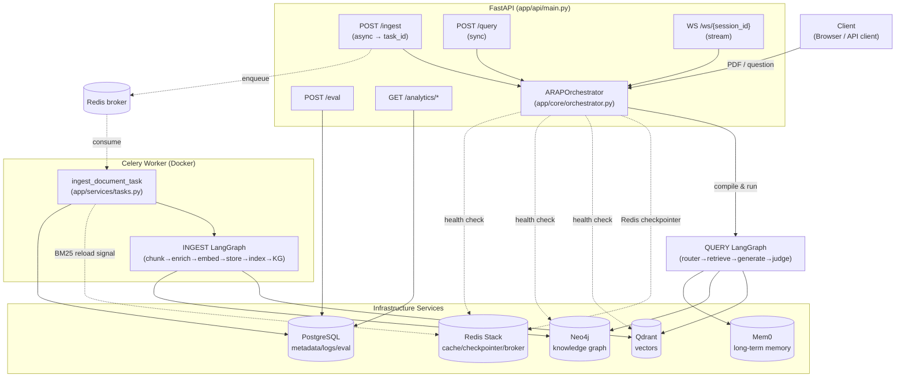
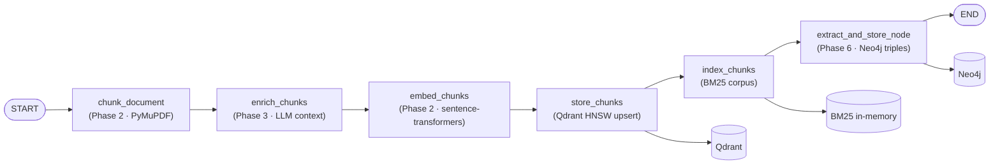
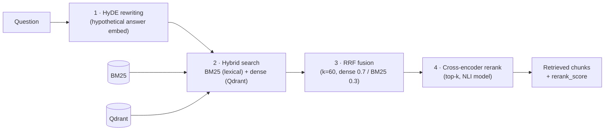
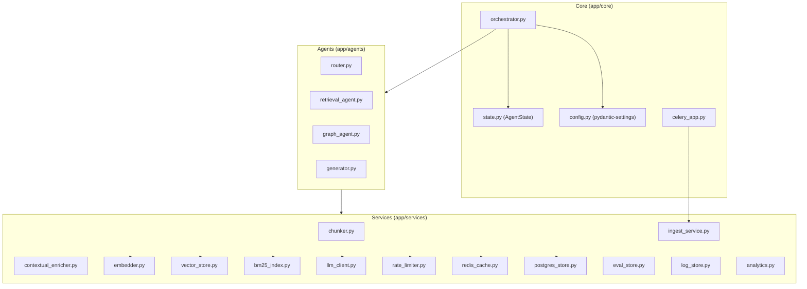
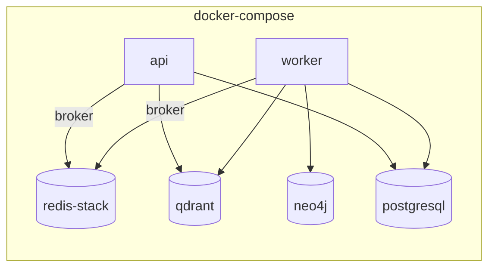
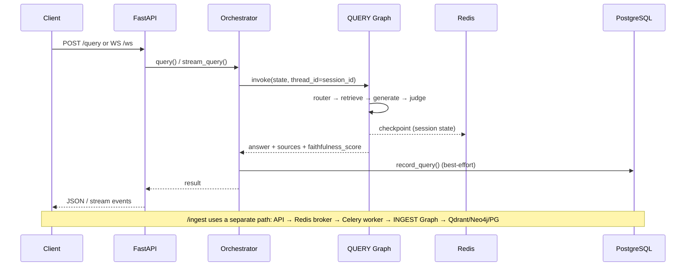

# ARAP — Architecture Diagrams

This file describes the architecture of the **Adaptive Research & Analysis
Platform (ARAP)** using Mermaid diagrams. The diagrams are based on the actual
code topology in `app/core/orchestrator.py`, `app/api/main.py`, and
`app/agents/*`. GitHub and VS Code (Mermaid extension) render this file directly.

---

## 1. System Overview

Client requests arrive at FastAPI. `/ingest` hands the heavy PDF processing off
to a **Celery worker** (Redis broker); `/query` and `/ws` run the per-request
**QUERY LangGraph**. All persistent and transient state lives on five
infrastructure services.

---

## 2. INGEST Graph (Document Processing — once per PDF)

`app/core/orchestrator.py → build_ingest_graph()`. A linear, branchless
pipeline. **KG extraction runs last** so the document stays searchable via
Qdrant/BM25 even if extraction is slow (graceful degradation). No checkpointer
(stateless).

---

## 3. QUERY Graph (Query — per request, adaptive)

`app/core/orchestrator.py → build_query_graph()`. Two conditional edges:
(1) `router → get_route()` branches to 4 strategies; (2) `judge → should_retry()`
drives the retrieve/generate retry loop. The single cycle (retry loop) relies on
LangGraph's native cycle support. The Redis checkpointer preserves multi-turn
memory keyed by `session_id`.

> **Adaptive routing strategies** (`app/agents/router.py`):
> `direct` (parametric knowledge, no retrieval) · `single` (one hybrid round) ·
> `multi_hop` (decompose into sub-questions + merge) · `graph` (Neo4j Cypher).
> Falls back to `single` on any error.

---

## 4. Retrieval Stack (4 Layers)

Implemented in `app/agents/retrieval_agent.py`, used by both `retrieve` and
`retrieve_multi`.

> Results are cached in Redis keyed by `(question, doc_id)`.

---

## 5. Service Layer and Dependencies

---

## 6. Infrastructure Services (Docker Compose)

| Service | Image | Role |
| --- | --- | --- |
| **API** | `Dockerfile` | FastAPI + Uvicorn (HTTP + WebSocket) |
| **Worker** | `Dockerfile` | Celery worker (async ingest) |
| **Qdrant** | `qdrant/qdrant:v1.12.0` | Dense vector store (`arap_docs`) |
| **Neo4j** | `neo4j:5.25-community` | Knowledge graph (Cypher) |
| **Redis Stack** | `redis/redis-stack:latest` | Checkpointer + broker + cache |
| **PostgreSQL** | `postgres:16-alpine` | Metadata, logs, eval, history |

---

## 7. End-to-End Flow

